# Arguments

Un répertoire d'arguments philosophiques reconstruits.

## Outil utilisé

J'utilise [Mermaid](https://mermaid-js.github.io/mermaid/#/), un logiciel de création de schémas à partir d'un simple fichier texte.

J'ai créé un [modèle](https://mermaid.live/edit#pako:eNp1VO1O2zAUfZWLq6LCCONDSCxlSKPwgwmtlYr2h_DDtS-ph2MH2xFjbR6I5-DFdpOmTTZBI9XNPefcY9976wUTViKLWb-_UEaFGBYJC3PMMGFxwmbc04-9JjSaTikKCet9c2mRoQngUISFD84-YhwcNz7njuJDeFBaxz08qZ4SWgERDCyE1dZ1BSXso0zxhs9QN2jv9PSU8lgTIq_-YHyw_wWzIWTcpcpETqXzEB_nv7tKUI1WOJV5axosynkI6EwkLa1yvd8PSN5qteGkDpEYvQdtn8WcuxDlVplwZeSiPmGDQ3qn5O7XJEnYuPq6h93_XLZUllsXeF2b7plOMCtBKCc0fkrr8jRneJ6rgENYgx2_NlfZMR41xrBizjQXj8Nuqtr2GevCzayWZdvZn9wpPtPoqb80AB6FNZK7l1Elryeh06taltOx_iHUHl3owjqJriXUG0pYSYxNNVd285Dpun-VfXAFVkm4lMqkFDg6oFdyf5zmXKxDZQllv5-YTSa4vUgM0Kff50LcqqAxBlocdsKX6IWLoV5UHpQ1K9AXs9TxfA7rMV2FparGm1id5HA4SNjEvb1mylf_jZ0NMLGFgyIorTw6oFpCWlAjqLrBg6TqQWEQ8rUUYug9FTYM28wQRefLCXdA1fdvr08F7WR51MG34Yg4EUxuDgeD7Z3WezS4owGwRujCV6di9w32_m7fdxqtwA9zoZEbw_HF96vR7fX4x7QNHZJuPPu1KhnJOki0Hy3P1Lldo7B19lmdL4_ZHsvQZVxJuoIWlaC9fWB9_SSmJF6RSx7wSqpgHYsfuPa4x3gR7PTFiGZsGtKl4tTOrGGVfwEyEaoQ) pour pouvoir reconstruire des arguments à l'aide de Mermaid.

[](https://mermaid.live/edit#pako:eNp9VO1O2zAUfZVLqqLCCINWSCxlSKPwYxNaKxXtD-GHa19SD8cOtqOOtXkgnoMX202atNlU1kp1c8-599yveBlwIzCIgm53KbX0ESzjwM8xxTiI4mDGHP05qk2j6ZSsEAedLzbJU9QeLHK_dN6aJ4y8ZdplzJJ9CI9SqaiDZ-W3gK0DETQsuVHGth0KOEaR4C2boarRzvn5OcUx2odO_sbo5PgTpkNImU2kDq1M5j4aZL_aniBrX25l6oyusTBj3qPVoTB0iibfd0jOKLnhJBaRGJ1HZRZ8zqwPMyO1v9FiWVVY45DcS3H4OY7jYFz-PMDhPyp7Ms2M9azqTbumM0wL4NJyhR-Sqj11DYu59DiEBmzpbWMVLeFRLQxr5kwx_jRsh6pkF1g1bmaUKLaT_cGsZDOFjuZLC-CQGy2YfRmV7tUmtGZVuWVU1l-ESqMNXRkr0G4JVUJxUBBj08213NynqppfKe9tjmUQJoTUCRn6J_RI6k_TjPHGVBRQdLux3kSCu6tYA326Xcb5nfQKI6DDYst8jY7bCKpDZl4avQZdPkssy-bQrOnaLGS53sRqBYfTXhxM7NtrKl35bhxsgInJLeReKunQAvUSkpwGQd31DgR1D3KNkDWuEEHnOTd-uI0MYXi5mjAL1H339vqcUyarfgvfhz5xQpjcnvZ6-wdb7VHvnhbAaK5yV1YVPNTY7mxLpR1SozXa3-kz2GntU06DHTnRE_xH4t18UYtNUeOrbzeju6_j79O1aXxKTuPZz_VMyKcxh8fh6kJemgaCvYuP8nI1CI6CFG3KpKALblmyt3cbNJdbrAvi5ZlgHm-E9MYG0SNTDo8ClnszfdG8XsqadC0ZLUtas4o_3d7GpA)

On peut tester ce modèle dans l'outil en ligne [Mermaid - Live Editor](https://mermaid.live/edit#pako:eNp9VO1O2zAUfZVLqqLCCINWSCxlSKPwYxNaKxXtD-GHa19SD8cOtqOOtXkgnoMX202atNlU1kp1c8-599yveBlwIzCIgm53KbX0ESzjwM8xxTiI4mDGHP05qk2j6ZSsEAedLzbJU9QeLHK_dN6aJ4y8ZdplzJJ9CI9SqaiDZ-W3gK0DETQsuVHGth0KOEaR4C2boarRzvn5OcUx2odO_sbo5PgTpkNImU2kDq1M5j4aZL_aniBrX25l6oyusTBj3qPVoTB0iibfd0jOKLnhJBaRGJ1HZRZ8zqwPMyO1v9FiWVVY45DcS3H4OY7jYFz-PMDhPyp7Ms2M9azqTbumM0wL4NJyhR-Sqj11DYu59DiEBmzpbWMVLeFRLQxr5kwx_jRsh6pkF1g1bmaUKLaT_cGsZDOFjuZLC-CQGy2YfRmV7tUmtGZVuWVU1l-ESqMNXRkr0G4JVUJxUBBj08213NynqppfKe9tjmUQJoTUCRn6J_RI6k_TjPHGVBRQdLux3kSCu6tYA326Xcb5nfQKI6DDYst8jY7bCKpDZl4avQZdPkssy-bQrOnaLGS53sRqBYfTXhxM7NtrKl35bhxsgInJLeReKunQAvUSkpwGQd31DgR1D3KNkDWuEEHnOTd-uI0MYXi5mjAL1H339vqcUyarfgvfhz5xQpjcnvZ6-wdb7VHvnhbAaK5yV1YVPNTY7mxLpR1SozXa3-kz2GntU06DHTnRE_xH4t18UYtNUeOrbzeju6_j79O1aXxKTuPZz_VMyKcxh8fh6kJemgaCvYuP8nI1CI6CFG3KpKALblmyt3cbNJdbrAvi5ZlgHm-E9MYG0SNTDo8ClnszfdG8XsqadC0ZLUtas4o_3d7GpA).

La [documentation de Mermaid](https://mermaid-js.github.io/mermaid/#/flowchart) est très utile : il faut regarder la section sur les schémas de type “Flowchart”.
