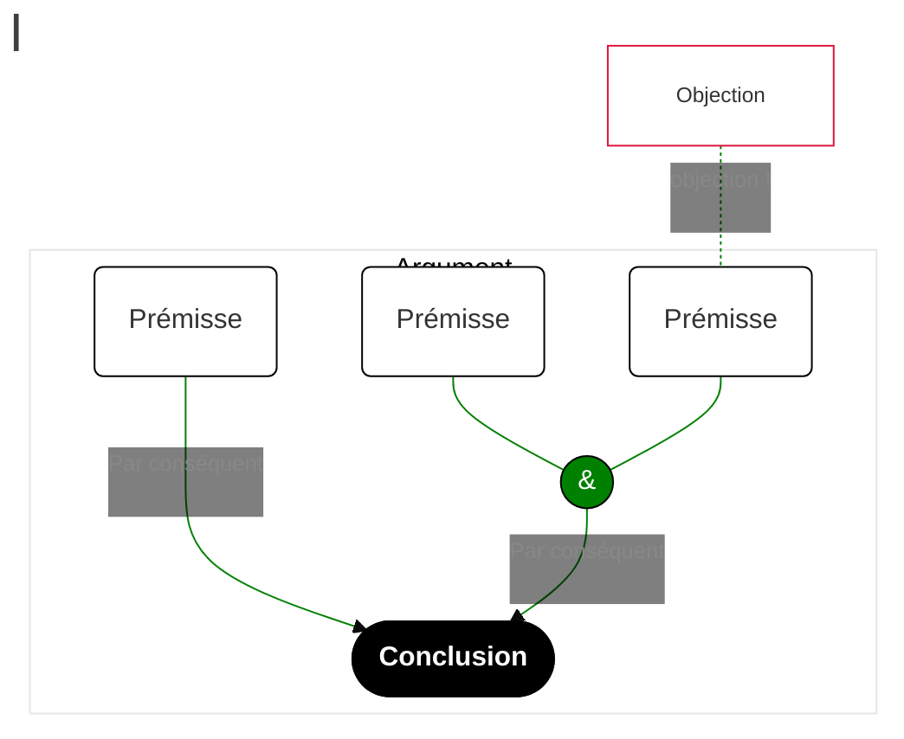

# Arguments

Un répertoire d'arguments philosophiques reconstruits.

## Outil utilisé

J'utilise [Mermaid](https://mermaid-js.github.io/mermaid/#/), un logiciel de création de schémas à partir d'un simple fichier texte.

J'ai créé un [modèle](https://mermaid.live/edit#pako:eNp1VO1O2zAUfZWLq6LCCOJDSCzVJo3Cj01orVS0P4Qfrn1JPRw72I6ApXkgnoMX202aNhlijVQn95x7z_2SSyasRBaz4bBURoUYyoSFJWaYsDhhC-7p5aA1TeZzskLCBt9cWmRoAjgUofTB2QeMg-PG59yRfQz3Sut4gGf1U0HnQAQDpbDaur5DBYcoU7zmC9QtOjg_P6c41oTIqz8YHx1-xmwMGXepMpFT6TLEp_lz6xnlPAR0JpKWTrnJSTiVeWvek7zVastJHSIxBvfaPokldyHKrTLhysiyqaLFIb1Vcv9LkiRsWv_dwf47lR2V5dYF3tTfz_sMswqEckLjp7RpQVvj01IFHMMG7Ol1saqe8KQVhjVzobl4GPdDNbJP2DRnYbWsuun94k7xhUZPM6QhexTWSO5eJrV7M-3ePBq3nMr6h9Bo9KEL6yS6jtAklLCKGNturuWWIdPNdGv54Aqsg3AplUnJcHJEn6T-MM-52JiqCqrhMDHbSHBzkRig33DIhbhRQWMMdDjsmS_RCxdDc6g8KGvWoC8WqeP5EjaruDZLVa8wsXrB4XiUsJl7e82Ur_d_bwvMbOGgCEorjw6ol5AWNAjqbvAgqXtQGIR84woxDB4LG8ZdZIiir6sZd0Dd92-vjwVlsjrp4btwQpwIZtfHo9HuXqc9Gd3SAlgjdOHrqthdi32c7cdKkzX431ho5FZwevHjanLzffpz3pmOyW-6-L1uGbn1kOgwWtkNBDurU3bAMnQZV5Lul7JmdlcLbO6WxFTEK3LJA15JFaxj8T3XHg8YL4KdvxjR7ktLulSc5pi1rOovbpadgw) pour pouvoir reconstruire des arguments à l'aide de Mermaid.

On peut tester ce modèle dans l'outil en ligne [Mermaid - Live Editor](https://mermaid.live/edit#pako:eNp9VO1O2zAUfZWLqyJgBEErJJZqk0bhxya0ViraH8IP176kHo4dbEeMtXkgnoMX202atBnq1kpxcu6599wvecmElchi1u8vlVEhhmXCwgIzTFicsDn39HLcQOPZjFBIWO-LS4sMTQCHIix9cPYR4-C48Tl3hI_gQWkd9_C8-pewdSCCgaWw2rquQwknKFO84XPUjbV3cXFBcawJkVe_MT49-YjZCDLuUmUip9JFiIf5r8YzynkI6EwkLZ2yzUk4lXlr3pO81WrDSR0iMXoP2j6LBXchyq0y4drIZV1FY4f0TsmjT0mSsEn1uIejdyp7KsutC7yuv5v3OWYlCOWExg9p3YKmxueFCjiC1tjR28YqO8LjRhjWzLnm4nHUDVXLPmPdnLnVstxO7wd3is81epohDdmjsEZy9zKu3Otpd-ZRu-VU1l-EWqNrurROotsS6oQSVhJj08213CJkup5uJR9cgVUQLqUyKQGDU_ok9cdZzkULlSWU_X5iNpHg9jIxQL9-nwtxq4LGGOhw2IGv0AsXQ32oPChr1kZfzFPH8wW0q7iGpapWmFid4HB2kLCpe3vNlK_2_3BjmNrCQRGUVh4dUC8hLWgQ1N3gQVL3oDAIeesKMfSeChtG28gQRZ9XU-6Auu_fXp8KymQ16Nj3YUCcCKY3ZwcH-4db7fHBHS2ANUIXvqqK3Te23dlWSjukxmtr9znY6T_ciQ4ov-GO_OgL_iP3z9zRyE2Bk8tv1-Pbr5PvszU0OSOnyfznej7k08LRSbSyLQ57qyE7Zhm6jCtJN9myom0vMWhvscSUxCtyyQNeSxWsY_ED1x6PGS-Cnb0Y0WxmQ7pSnDYma1jlH-S4vKs).

